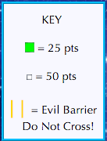

##Project 1 - SNAKE

For my project one I decided to recreate the game of snake. The goal is to navigate your snake around to eat as much food as it can without running into itself. My version is a bit different, instead of the snake avoiding itself, the challenge is to avoid evil barriers. The evil barriers are randomly generated every 10 seconds and exist for 5 seconds.

Two types of food exist for the snake to eat. The white is smaller and harder to find, worth 50 points as shown by the key. The green food is easier to spot and worth 25 points. The white food makes the snake size as well as the user's score increase more than the green food.
These basic instructions can all be referenced on screen in the key.

 

The user controls the snake using the arrow keys on the keyboard. Upon press, the snake will travel in that direction until another arrow key is pressed.

Below is an image of what the game looks like at the start of play. The start button must be pressed for gameplay to intialize.

Here is a screenshot during play. You can see the player has accumulated a score and the snake has grown in size.

## My Wireframe
To help more easily implement code to create this game, I have created a wireframe. This shows some features and functionality I plan to incorporate in my game. All red is text indicating functionality, this text wont actually show on the final product.

## My User Stories
I thought about what user's would want to see / have upon landing on my game's site. This way I can know what I want to incorporate when I start coding. I wrote down some of the more important scenarios below.

